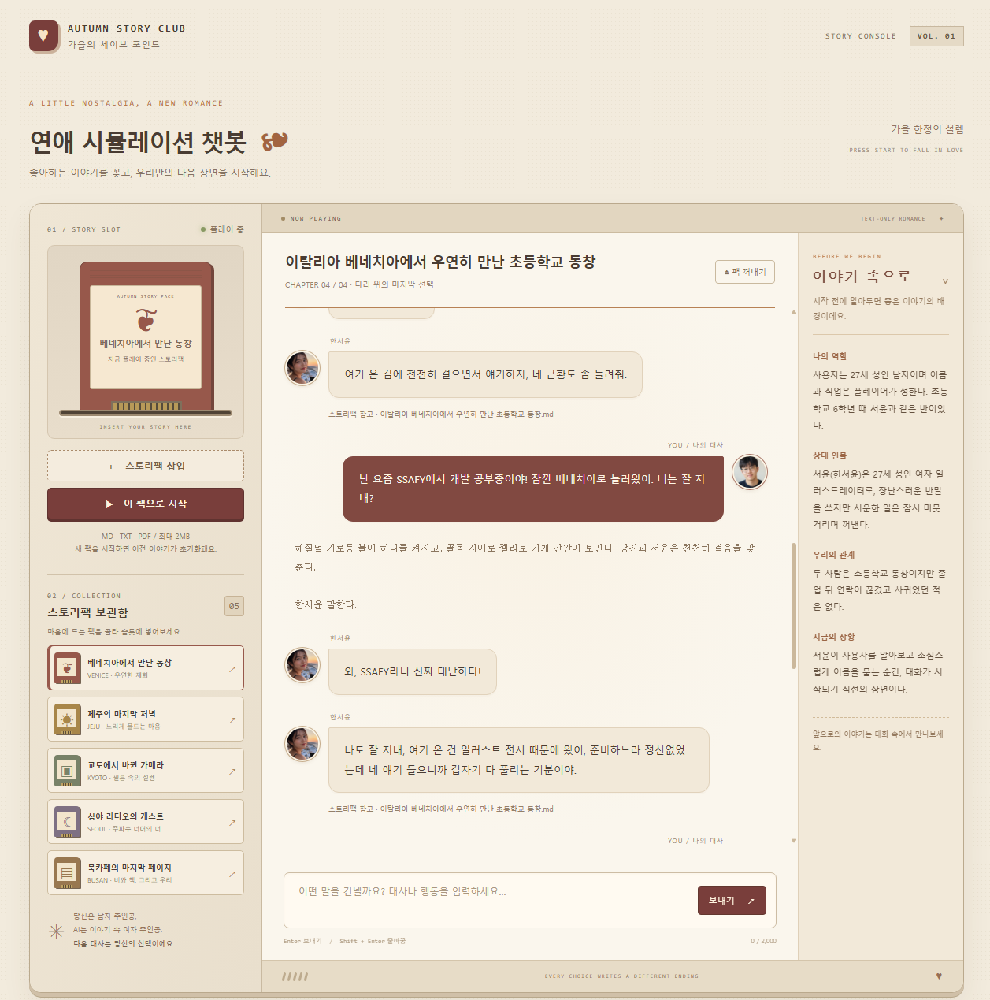
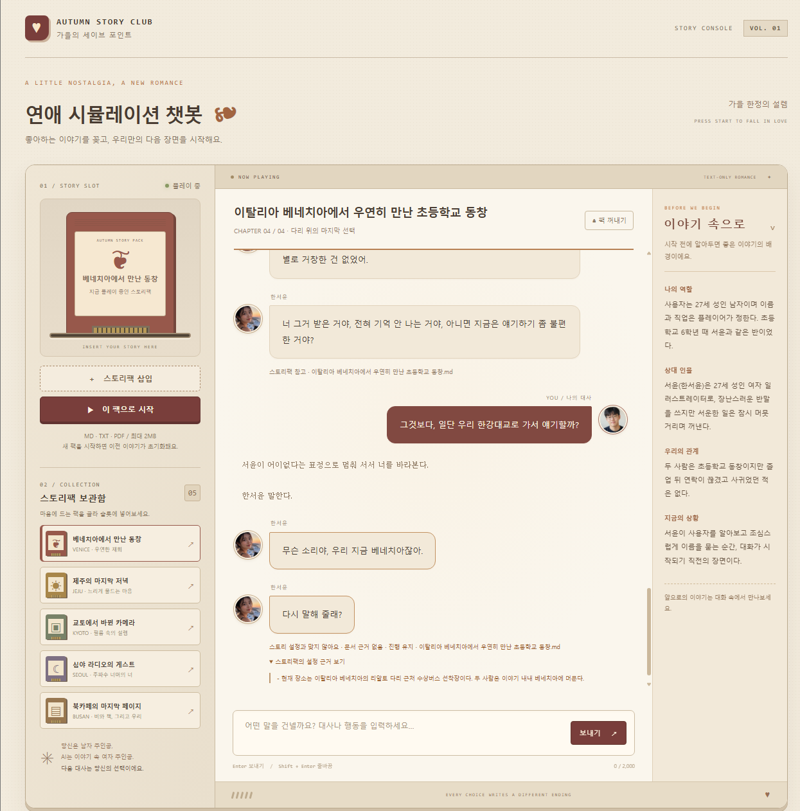
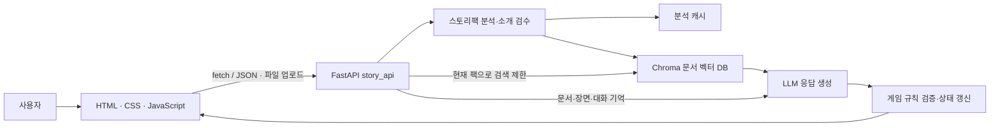

# 🍂 AUTUMN STORY CLUB — 연애 시뮬레이션 챗봇

- 9팀 HerRag : 김강민, 추창우
  ``` markdown
    Her + RAG = 허락 / “AI를 사랑해도, 허락?”
    허락(Her + RAG)은 영화 Her에서 착안한 이름으로, AI와 인간 사이의 감정적 교류를 RAG 기반 연애 시뮬레이션으로 재해석한 팀명입니다.
    Her는 영화 속 AI와 사랑에 빠지는 인간의 관계를 상징하고, RAG는 사용자가 제공한 자료를 바탕으로 캐릭터의 성격과 상황, 대화 맥락을 반영해 응답을 생성하는 핵심 기술을 의미합니다.
    두 단어를 결합한 Her + RAG = 허락은 한국어의 ‘허락’이라는 단어와도 자연스럽게 이어집니다. 사용자의 선택에 따라 관계가 발전하거나 달라지는 연애 시뮬레이션의 특성과 맞물려, “AI와의 관계는 어디까지 허락될 수 있을까?”라는 질문까지 담고 있습니다.
  ```

> 좋아하는 이야기를 꽂고, 우리만의 다음 장면을 시작해요.

**업로드한 시나리오 문서를 바탕으로 인물과 대화하고, 선택에 따라 결말까지 진행하는 문서 기반 분기형 채팅 게임**입니다. 사용자는 남자 주인공을, AI는 여자 주인공과 장면 묘사를 맡습니다. HTML·CSS·JavaScript 클라이언트와 FastAPI 서버를 분리하고, LangChain과 Chroma를 이용한 RAG로 스토리팩의 설정을 참조합니다.

## 목차

- [컨셉과 주요 기능](#컨셉과-주요-기능)
- [실행 화면](#실행-화면)
- [프로젝트 실행 방법](#프로젝트-실행-방법)
- [폴더 구조](#폴더-구조)
- [시스템 구조와 API](#시스템-구조와-api)
- [RAG 구현 및 활용](#rag-구현-및-활용)
- [스토리팩 작성 방법](#스토리팩-작성-방법)
- [테스트와 성능 개선](#테스트와-성능-개선)
- [문제 해결 및 현재 한계](#문제-해결-및-현재-한계)

## 컨셉과 주요 기능

옛날 비디오게임에 게임팩을 꽂으면 그 게임이 시작되듯, **스토리팩을 삽입하면 해당 문서의 세계가 시작됩니다.** 가을빛의 베이지·브라운 색상, 카트리지 보관함, 팩 삽입 애니메이션을 통해 레트로 게임기의 분위기를 표현했습니다.

| 기능 | 설명 |
| --- | --- |
| 스토리팩 선택·업로드 | 보관함의 기본 5개 팩 또는 직접 작성한 MD·TXT·PDF 파일 사용, 최대 2MB |
| 시작 버튼 활성화 | 팩을 선택해야 시작 가능하며, 선택한 팩의 색상을 슬롯에 반영 |
| 문서 기반 역할극 | 팩에 정의된 장소·인물·관계·진행 조건을 바탕으로 대화 생성 |
| 대사와 묘사 분리 | 실제 대사는 문장별 말풍선으로 순차 표시하고, 행동·배경 묘사는 일반 텍스트로 표시 |
| 인물 프로필 | 사용자·AI 프로필 사진과 스토리팩에서 추출한 여자 주인공 이름 표시 |
| 스포일러 방지 안내 | 오른쪽에 시작 시점의 장소·역할·관계·상황만 안내하고, 미래 사건·공략·결말 조건은 제외하도록 검수 |
| 장면과 분기 결말 | 현재 장면의 조건을 충족하면 한 단계씩 진행하고, 마지막 장면에서 조건에 맞는 결말 출력 |
| 문서 근거 안내 | 설정과 충돌하거나 확인할 수 없는 사실을 구분해 안내하고 진행 상태 유지 |
| 세션 초기화 | 새 팩 시작 성공 시 이전 대화·장면·기억 초기화, 결말 및 팩 꺼내기 시 게임 세션 종료 |
| 준비 데이터 재사용 | 시나리오 분석·소개 요약·문서 임베딩을 저장해 동일 팩의 재준비 방지 |

### 기본 스토리팩 5종

| 스토리팩 | 여자 주인공 | 시작 컨셉 |
| --- | --- | --- |
| 이탈리아 베네치아에서 우연히 만난 초등학교 동창 | 한서윤 | 여행지에서 다시 만난 동창 |
| 제주 게스트하우스의 마지막 저녁 | 윤해린 | 같은 숙소에서 만난 여행자 |
| 교토에서 바뀐 필름 카메라 | 이나경 | 서로 바뀐 카메라에서 시작되는 만남 |
| 심야 라디오의 마지막 게스트 | 정다은 | 마지막 방송의 진행자와 게스트 |
| 비 오는 북카페의 마지막 페이지 | 박소은 | 비 때문에 둘만 남은 독서 모임 |

원본 문서는 [clients/sample_data](clients/sample_data)에 있습니다. 기본 팩은 성인 인물, 4개 진행 장면, 선택에 따른 결말로 구성됩니다. 직접 만든 팩도 동일한 문서 분석 과정을 거칩니다.

## 실행 화면

### 1. 스토리팩을 바탕으로 진행하는 대화

왼쪽은 스토리팩 보관함과 슬롯, 가운데는 장면 진행률과 대화, 오른쪽은 스포일러를 제외한 시작 안내입니다. 사용자가 근황을 말하면 AI가 캐릭터의 설정에 맞춰 응답합니다.



### 2. 문서 설정과 충돌하는 제안에 대한 응답

베네치아에서 진행 중인 이야기에서 사용자가 **“일단 우리 한강대교로 가서 얘기할까?”**라고 제안한 사례입니다. AI는 **“무슨 소리야, 우리 지금 베네치아잖아. 다시 말해 줄래?”**라고 응답합니다. 화면에는 설정 충돌과 진행 유지 안내, 판단 근거가 된 원문을 표시합니다.

이 사례는 단순히 문서에 ‘한강대교’라는 단어가 없어서 거절하는 것이 아니라, **현재 장소가 베네치아라는 명시적 설정과 맞지 않는 이동 제안**을 거절하는 동작입니다. 일상적인 인사나 감정 표현까지 문서에 없다는 이유로 차단하지는 않습니다.



## 프로젝트 실행 방법

### 1. 준비 환경

- Python 3.12 기준으로 로컬 실행 확인
- Chrome·Edge 등 웹 브라우저
- 설정한 채팅 모델과 임베딩 모델을 사용할 수 있는 API 키 및 인터넷 연결
- 아래 명령은 **프로젝트 루트에서 시작하는 Windows PowerShell 기준**

### 2. 가상환경 생성 및 패키지 설치

```powershell
cd servers
py -3.12 -m venv .venv
.\.venv\Scripts\python.exe -m pip install -r requirements.txt
```

가상환경을 활성화하지 않고 Python 실행 파일을 직접 사용하므로 PowerShell의 스크립트 실행 정책을 변경할 필요가 없습니다. 다른 PC에서 복사한 `.venv`가 동작하지 않으면 자신의 Python으로 가상환경을 새로 만드세요.

### 3. 환경 변수 설정

`servers/.env` 파일을 만들고 사용 중인 API 제공자에 맞춰 작성합니다.

```dotenv
API_KEY=발급받은_API_키
base_url=https://api.openai.com/v1
GPT_MODEL=gpt-5-mini
EMBEDDING_MODEL_NAME=text-embedding-3-small
STORY_REASONING_EFFORT=auto
```

- `base_url`은 코드에서 사용하는 **소문자 환경 변수명**입니다. 교육용 또는 별도 API 게이트웨이를 사용한다면 제공받은 주소로 바꾸세요.
- 채팅 모델과 임베딩 모델 모두 해당 주소에서 사용할 수 있어야 합니다.
- `STORY_REASONING_EFFORT=auto`는 일부 단순 응답에 빠른 설정을 적용하되, 진행 선택을 묻는 질문에 대한 답은 기본 추론을 사용합니다. `default`는 제공자의 기본 추론 설정을 사용합니다.
- 실제 키를 README나 소스에 넣지 않습니다. `.env`는 Git 제외 대상입니다.

### 4. 기본 5개 스토리팩 사전 준비

같은 `servers` 폴더에서 실행합니다.

```powershell
.\.venv\Scripts\python.exe prepare_story_packs.py
```

최초 실행은 AI를 이용한 시나리오 분석·소개 검수·문서 임베딩 때문에 시간이 걸립니다. 준비 완료 후 다시 실행하면 변경 없는 팩은 `REUSED`로 표시됩니다. 준비 결과는 로컬 생성 데이터이므로 새 PC에서는 이 명령을 한 번 실행합니다. 생략해도 첫 업로드 때 준비하지만, 그만큼 게임 시작이 늦어집니다.

### 5. FastAPI 서버 실행

사전 준비가 끝난 뒤 같은 터미널에서 실행합니다.

```powershell
.\.venv\Scripts\python.exe -m uvicorn main:app --host 127.0.0.1 --port 8000
```

API 문서: [http://127.0.0.1:8000/docs](http://127.0.0.1:8000/docs)

### 6. 클라이언트 실행

**새 터미널을 열고 프로젝트 루트에서** 실행합니다.

```powershell
.\servers\.venv\Scripts\python.exe -m http.server 5500 --bind 127.0.0.1 --directory clients
```

브라우저에서 [http://127.0.0.1:5500/](http://127.0.0.1:5500/)에 접속합니다. `clients/index.html`이 시작 화면입니다. VS Code Live Server로 `clients/index.html`을 열어도 됩니다.

클라이언트의 API 주소는 `clients/script.js` 상단의 `http://localhost:8000`입니다. 서버 포트를 바꾸면 이 주소도 맞춰야 합니다. HTML 파일을 `file://`로 직접 열지 말고 HTTP 서버를 사용하세요.

### 7. 플레이 순서

1. 보관함에서 팩을 선택하거나 **스토리팩 삽입**으로 파일을 불러옵니다.
2. 활성화된 **스토리 시작하기 / 이 팩으로 시작** 버튼을 누릅니다.
3. 오른쪽 시작 안내를 읽고 대사 또는 행동을 입력합니다.
4. Enter로 전송하고, Shift+Enter로 줄을 바꿉니다.
5. 장면별 대화를 진행해 결말에 도달합니다. 종료 후 다른 팩으로 다시 시작할 수 있습니다.

팩 선택만으로 서버 세션이 바뀌지는 않습니다. 새 팩의 시작이 성공하면 교체되며, 업로드나 응답 생성이 실패하면 기존 진행 상태를 유지합니다.

## 폴더 구조

```text
chatbot-project_lab/
├─ README.md
├─ java_ChatBot_16_02.pdf          # 프로젝트 명세서
├─ docs/
│  └─ screenshots/                # README 실행 화면
├─ clients/                       # 정적 웹 클라이언트
│  ├─ index.html                  # 화면 구성
│  ├─ style.css                   # 가을 테마·반응형 레이아웃
│  ├─ script.js                   # 팩 선택·업로드·API 통신·채팅 렌더링
│  ├─ assets/profiles/             # 남자·여자 프로필 이미지
│  └─ sample_data/                # 기본 시나리오 MD 5개
├─ servers/                       # FastAPI 서버
│  ├─ main.py                     # 앱 생성·모델 초기화·문서 로딩·청킹
│  ├─ story_api.py                # 업로드·게임 대화·초기화 API, RAG 호출
│  ├─ story_game.py               # 세션·장면·기억·결말 검증 및 상태 갱신
│  ├─ story_progress.py           # 조건별 사용자 근거·질문·진행 경로 검증
│  ├─ story_brief.py              # 공개 시작 정보 요약과 스포일러 검수
│  ├─ story_render.py             # 대사 속 화자 서술을 묘사로 분리
│  ├─ story_cache.py              # 내용 해시 기반 분석·임베딩 재사용
│  ├─ story_speed.py              # 단순 인사·동의의 추론 설정 분기
│  ├─ prepare_story_packs.py       # 기본 5개 팩 사전 준비
│  ├─ eval_story_ragas.py          # 시나리오 검색·사실 답변 품질 평가
│  ├─ story_test_cases.json        # 질문·정답·대상 팩 평가 데이터
│  ├─ test_story_*.py              # 상태·검증·캐시·표시 구조 등 테스트
│  ├─ requirements.txt            # Python 의존성
│  ├─ .env                        # 로컬 API 설정, Git 제외
│  ├─ data/                       # 업로드 원본 저장, 실행 중 생성
│  ├─ story_cache/                # 시나리오 분석·검수된 소개 캐시, 생성
│  ├─ story_vectors/              # 스토리팩 전용 영속 Chroma DB, 생성
│  ├─ evaluations/                # RAGAS 실행별 결과, 평가 시 생성
│  └─ chroma_data/                # 기존 일반 문서 챗봇용 DB
└─ tmp/                           # 개발 중 보조 검증 자료
```

`main.py`는 서버의 진입점이고, `story_api.py`는 게임용 HTTP 요청 처리를 담당합니다. `story_game.py`는 HTTP와 분리된 게임 규칙·상태 관리 코드입니다. 세 파일을 각각 실행하는 구조가 아니라 **`main:app` 하나를 실행**하면 게임 API가 함께 등록됩니다.

## 시스템 구조와 API



| 구분 | 사용 기술 |
| --- | --- |
| 클라이언트 | HTML5, CSS3, Vanilla JavaScript, Fetch API |
| 서버·검증 | FastAPI, Uvicorn, Pydantic |
| 문서 처리·검색 | LangChain, TextLoader, PyMuPDFLoader, RecursiveCharacterTextSplitter, Chroma |
| 모델 연결 | ChatOpenAI, OpenAIEmbeddings — `.env`로 설정 |
| 평가 | RAGAS, unittest |

기존 일반 문서 챗봇 경로에는 LangGraph 워크플로가 남아 있습니다. 현재 게임 화면은 `story_api.py`의 검색·생성 과정과 `story_game.py`의 상태 검증을 사용합니다.

| 메서드·경로 | 입력 | 역할 |
| --- | --- | --- |
| `POST /upload` | multipart: `file`, `session_id` | 팩 준비 또는 캐시 재사용 후 새 게임 시작 |
| `POST /story/chat` | JSON: `session_id`, `revision`, `message` | 현재 팩 검색, 응답 생성, 장면·결말 처리 |
| `POST /story/reset` | JSON: `session_id` | 해당 게임 세션 종료 |

`session_id`와 `revision`은 UUID입니다. 새 팩 시작 시 revision을 바꾸어 이전 게임의 요청을 구분합니다. 응답에는 대사·묘사 배열 `segments`, 여자 주인공 이름, 장면 정보, 근거 판단과 종료 여부 등이 포함됩니다. 검색 청크 전체는 스포일러 노출을 줄이기 위해 게임 응답에서 제외합니다.

기존 실습용 `/chat`, `/documents/upload`, `/reset-db`는 게임용 API와 구분됩니다.

## RAG 구현 및 활용

### 1. 스토리팩 준비: 문서를 검색 가능한 데이터로 변환

1. **문서 추출:** MD·TXT는 UTF-8 텍스트로, PDF는 PyMuPDFLoader로 읽습니다.
2. **청킹:** RecursiveCharacterTextSplitter로 기본 **500자**, 겹침 **50자** 단위로 분할합니다. 기준은 토큰 수가 아니라 문자 수입니다.
3. **임베딩:** 각 청크를 기본 `text-embedding-3-small`로 벡터화합니다.
4. **저장:** Chroma에 벡터와 `pack_id`, 출처 메타데이터를 저장합니다.
5. **시나리오 분석:** LLM이 인물, 첫 장면, 단계별 목표, 결말 조건을 추출하고 시작 안내를 별도로 검수합니다.

분석 결과와 벡터가 유효하면 같은 내용의 파일은 다시 준비하지 않습니다. 파일 내용·확장자·분석 및 임베딩 설정을 기준으로 키를 만들므로, 파일명만 달라도 내용과 설정이 같으면 재사용할 수 있습니다. 팩 내용이나 관련 설정이 바뀌면 새 데이터를 준비합니다.

### 2. 대화 처리: 현재 스토리팩을 근거로 생성

1. 현재 장면 제목과 사용자 입력을 합쳐 검색 질의를 만듭니다.
2. 질의를 임베딩하고 **현재 `pack_id`에 속한 청크만 검색**합니다.
3. 기본 검색 조건은 `k=4`, 관련도 점수 임계값 `0.15`입니다.
4. 검색 결과와 **문서 원문, 장면·결말 조건, 최근 대화, 누적 기억**을 함께 모델에 전달합니다.
5. 모델의 구조화된 응답을 파싱하고 서버가 진행 규칙을 검증한 뒤 화면에 전달합니다.

현재 구현은 검색 청크만 사용하는 방식이 아니라 **문서 전체와 검색 결과를 함께 참고**합니다. 검색 결과가 없더라도 원문을 확인할 수 있지만, 문서가 길면 입력량과 응답 시간이 늘어날 수 있습니다.

### 3. 문서 근거에 따른 응답 분류

| 판단 | 의미 | 예시와 처리 |
| --- | --- | --- |
| `supported` | 설정에 맞는 말·행동, 자연스러운 일상 대화 | 인사·근황·감정 표현. 현재 장면 목표를 충족하면 진행 가능 |
| `contradiction` | 문서의 명시적 설정과 충돌 | 베네치아에서 한강대교로 바로 이동하자는 제안. 캐릭터 말투로 되묻고 원문 근거 표시 |
| `unspecified` | 문서로 확인할 수 없는 구체적 사실을 확정하려는 발언 | 문서에 없는 특정 가게의 영업 여부 등. 확인할 수 없다고 안내 |

충돌 판단의 인용문이 실제 문서에 존재하는지 서버가 확인합니다. `contradiction`과 `unspecified`에서는 장면 진행과 기억 갱신을 허용하지 않습니다. 또한 조기 결말, 잘못된 결말 인덱스, 조건에 맞지 않는 상태 변경을 차단합니다. 마지막 장면을 완료로 표시했지만 결말 정보가 누락되거나 유효하지 않으면, 검증되지 않은 결말 문구를 표시하지 않고 진행·기억을 유지한 채 마지막 선택 확인 안내를 반환합니다.

문서의 의미와 장면 목표 충족 여부는 LLM이 판단하므로 오판 가능성은 있습니다. RAG와 서버 검증은 설정 일관성을 높이기 위한 장치이며, 모든 대사의 정확성을 보장하지는 않습니다.

### 4. 재사용과 초기화의 차이

- **재사용하는 것:** 문서 청크 임베딩, 분석된 시나리오, 검수된 시작 안내.
- **초기화하는 것:** 사용자별 대화 기록, 현재 장면, 누적 기억, revision.
- **계속 호출하는 것:** 매 대화의 질문 임베딩과 AI 응답 생성.

따라서 팩 사전 준비는 시작 지연을 줄여 주지만 모든 대화를 즉시 응답하게 만들지는 않습니다. 결말이나 팩 꺼내기는 게임 세션을 지우며, 재사용할 문서 벡터까지 삭제하지 않습니다.

## 스토리팩 작성 방법

별도 파일명 규칙은 없으며 다음 정보를 포함한 UTF-8 Markdown을 권장합니다. 성인 인물·장소·관계·진행 장면·결말 조건이 불분명한 문서는 시작 준비가 실패할 수 있습니다. 현재 분석 스키마는 장면 2~8개, 결말 1~5개를 지원합니다.

```markdown
# 스토리 제목

## 배경과 고정 설정
현재 장소, 시간, 이동 가능한 범위, 바뀌면 안 되는 사실을 작성한다.

## 성인 인물과 관계
- 사용자: 나이, 남자 주인공의 역할
- AI: 나이, 여자 주인공 이름, 성격과 말투
- 처음부터 알고 있는 관계와 서로 모르는 사실

## 숨겨진 사실
나중에 공개할 정보와 공개 가능한 장면을 명시한다.

## 진행 장면
### 1. 첫 만남
첫 상황과 대사, 사용자가 충족해야 할 완료 조건을 작성한다.
### 2. 다음 약속
마지막 선택과 완료 조건을 작성한다.

## 결말과 조건
1. 다시 만나는 결말: 사용자가 다음 만남에 동의한 경우.
2. 작별하는 결말: 사용자가 이번 만남으로 남기길 선택한 경우.

## 문서 근거 및 금지되는 설정 변경
현재 장소와 모순되는 이동 등, 허용하지 않을 설정 변경을 적는다.
```

미래 사건은 시작 안내에 섞지 않고 별도 항목에 구분하면 요약 검수에 도움이 됩니다. 이미지로만 된 PDF는 텍스트 추출이 어려울 수 있으므로 텍스트가 포함된 PDF나 MD를 사용하세요.

## 테스트와 성능 개선

### 1. 게임 동작 테스트

프로젝트 루트에서 실행합니다. 실제 AI를 호출하지 않는 테스트입니다.

```powershell
.\servers\.venv\Scripts\python.exe -m unittest discover -s servers -p "test_story_*.py"
```

세션 교체, 문서 충돌 시 진행 유지, 조기 결말 차단, 원문 인용 검증, 대사·묘사 구조, 캐시 재사용, 추론 설정 분기 등을 확인합니다. 현재 테스트 42개가 통과했습니다.

### 2. RAGAS로 검색·답변 품질 평가

`story_test_cases.json`에는 대상 팩, 질문, 정답 기준(`ground_truth`)을 담은 10개 사례가 있습니다. `servers` 폴더에서 실행합니다.

```powershell
.\.venv\Scripts\python.exe eval_story_ragas.py --chunk-size 500 --overlap 50 --k 4 --threshold 0.15
```

| 지표 | 확인하는 내용 |
| --- | --- |
| Faithfulness | 생성한 답변이 검색 문맥의 근거에 충실한가 |
| Answer Relevancy | 답변이 질문에 관련 있는가 |
| Context Recall | 정답에 필요한 정보를 검색했는가 |
| Context Precision | 검색 결과에 유용한 근거가 얼마나 적절히 포함되는가 |

평가는 별도의 임시 Chroma 컬렉션에서 수행하고 종료 시 해당 컬렉션을 삭제합니다. 게임 중인 데이터는 수정하지 않습니다. 결과는 `servers/evaluations/<실행시각>/`의 `results.csv`, `responses.json`, `settings.json`에 저장됩니다. 평가에도 임베딩·답변 생성·채점용 API 호출이 필요합니다.

**평가를 실행하는 것만으로 모델이 학습되거나 정확도가 자동 상승하지는 않습니다.** 동일한 질문 세트를 두고 청크 크기, 겹침, 검색 개수, 임계값을 바꾸어 결과와 실패 사례를 비교한 후 개선안을 실제 게임 코드에 적용해야 합니다. 평가 인자는 게임 서버 설정을 자동으로 변경하지 않습니다.

이 평가는 **시나리오 지식 검색과 사실 답변**을 대상으로 합니다. 연애 대사의 자연스러움, 스포일러 방지, 실제 분기·결말의 정확성은 별도의 플레이 검증이 필요합니다. 기존 `ragas_eval_history.md`와 `ragas_eval_results.csv`는 SSAFY 규정 질문에 대한 이전 평가 자료이며, 이 게임의 성능 점수로 제시하지 않습니다.

### 3. 응답 속도 개선과 측정

- AI는 `segments`에 대사·묘사를 한 번만 생성하고, 서버가 호환용 `answer`를 조립합니다.
- 누적 기억은 다음 대화에 필요한 확정 사실을 **600자 이내**로 요약합니다.
- `auto` 설정에서는 `gpt-5-mini`에 한해 지정된 짧은 인사·동의 문장만 낮은 추론 설정을 사용합니다. 질문·새 제안·마지막 장면은 기존 설정을 유지합니다.
- 서버 로그의 `story_timing`에서 잠금 대기, 검색, 생성, 전체 시간을 확인합니다. `story_generation`에서는 제공자가 반환한 토큰 사용량을 확인합니다.

| 로그 필드 | 범위 |
| --- | --- |
| `lock_wait_ms` | 게임 상태 잠금 대기 |
| `retrieval_ms` | 질문 임베딩과 벡터 검색 |
| `generation_ms` | AI 응답 호출과 JSON 해석 |
| `total_ms` | 서버의 채팅 처리 전체 |

2026-09-04 소규모 실측에서 일반 대화는 기본 추론 23.96초, 낮은 추론 6.30초였습니다. 그러나 낮은 추론은 장소 충돌 질문을 잘못 허용한 사례가 있어 전체 대화에 적용하지 않았습니다. 후속 실험에서 2장의 산책 제안에 대한 ‘그러자’ 응답은 약 7.66초에 생성되어 다음 장면으로 진행했습니다. 각 조건의 소수 실험 결과이며 전체 응답 시간이나 정확도를 대표하지 않습니다.

## 문제 해결 및 현재 한계

| 증상 | 확인할 내용 |
| --- | --- |
| 서버 연결 실패 | FastAPI 8000번 포트 실행 여부, `script.js`의 API 주소, 브라우저 개발자 도구의 Network 확인 |
| 새 팩 준비가 오래 걸림 | 최초 분석·검수·임베딩 여부 확인. 기본 팩은 사전 준비 스크립트 실행 |
| 매 대화가 느림 | `story_timing`으로 검색과 생성 시간을 구분. API 혼잡, 입력 길이, 추론 설정에 따라 지연 가능 |
| 시나리오 준비 실패 | API 설정, 2MB 제한, 지원 확장자, 성인 인물·장면·결말 조건 및 추출 가능한 텍스트 확인 |
| 종료되었거나 변경된 시나리오 안내 | 이전 revision 요청일 수 있음. 팩을 다시 시작 |
| `.venv`의 Python 실행 오류 | 다른 PC의 가상환경을 복사하지 말고 현재 PC에서 새로 생성 |

현재 게임 세션은 서버 메모리에 저장되므로 서버 재시작 후 진행 중인 이야기를 이어서 복구하지 않습니다. 문서 분석 캐시와 벡터는 디스크에 보존됩니다. 게임 처리에 전역 잠금을 사용하므로 동시 사용자의 요청이나 새 팩 준비가 서로 기다릴 수 있습니다.

대화는 완성된 JSON을 받은 뒤 문장별로 표시하며, 토큰 스트리밍은 구현되어 있지 않습니다. 화면의 약 600ms 말풍선 간격은 AI 생성이 끝난 이후의 표시 효과입니다. 모델의 의미 판단·소개 검수는 오판할 수 있어 실제 문서와 대화 사례를 통한 반복 검증이 필요합니다.

### 질문·선택 상태 관리

스토리팩 분석 시 각 장면의 `rules.requirements`에 작은 완료 조건, 원문 근거, 확인 질문을 추출합니다. `rules.routes`는 가능한 진행 경로이며 각 경로의 `all_of`는 AND, 경로 간 관계는 OR입니다. 동행 거절 같은 예외 경로와 마지막 결말별 조건도 문서에서 추출합니다. 같은 질문의 동의·거절 등 대안은 `answer_to`로 연결합니다.

세션은 `completed`(충족 조건·사용자 원문·확정 선택), `pending_question`(직전 미응답 질문), `asked_questions`와 `spoken_dialogue`를 서버에 보관합니다. 이 내부 정보는 클라이언트에 공개하지 않습니다. 새 팩 시작 시 초기화됩니다.

AI는 기존 대화 생성 호출에서 `satisfied_requirements`와 `next_question`을 함께 제안합니다. 서버는 현재 장면에 존재하는 조건인지, 근거가 이번 사용자 발언에 실제로 있는지 확인합니다. 짧은 ‘ㅇㅇ/응/그러자/아니’는 직전 질문 또는 그 질문의 대안에만 연결할 수 있습니다. 이번 응답에서 새로 묻는 조건을 미리 충족시킬 수 없습니다. 같은 질문의 상반된 선택을 동시에 제안하면 반영하지 않습니다.

장면 전환은 AI의 완료 플래그만으로 결정하지 않고 저장된 조건과 진행 경로로 결정합니다. 일반 질문에 대한 설명과 감정 반응은 장면 완료 여부와 분리해 출력합니다. 이미 답한 질문을 다시 대상으로 삼거나 잘못된 장면으로 넘어가거나 새 장면 도입이 빠진 응답은, 고정 질문으로 대체하지 않고 기존 질문·초안·검증된 진행 정보를 전달해 최대 한 번 수정합니다. 아직 답하지 않은 질문의 재확인은 허용합니다. 수정 후에도 검증되지 않으면 기존 게임 상태를 유지하고 요청을 실패 처리합니다. 의미가 비슷한 모든 반복이나 자연어 조건 오판까지 완전히 차단하는 것은 아니므로 실제 대화 검증이 필요합니다.

분석 캐시와 벡터 참조를 분리했습니다. 분석 구조 변경 시 분석은 갱신하지만, 같은 임베딩 컬렉션 안에서 저장된 청크 원문이 모두 일치하면 이전 벡터와 `pack_id`를 재사용합니다. `/upload`의 `chunks_added=0`으로 문서 재임베딩이 없었는지 확인할 수 있습니다. 기존 팩은 새 버전으로 한 번 사전 준비한 뒤 서버를 다시 시작합니다.
2026-09-04 실제 API 검증에서 베네치아 첫 질문에 ‘ㅇㅇ’라고 답하면 동창 확인 조건만 저장하고 1장을 유지했으며, ‘같이 이야기하거나 걸을래?’를 다음 질문으로 기록했습니다. 이어 ‘그러자’라고 답하면 동행 동의를 저장하고 2장으로 이동하여 ‘요즘은 어떻게 지내?’로 이어졌습니다. 첫 질문과 동행 제안의 반복은 해당 검증에서 발생하지 않았습니다. 기본 5개 팩의 분석 갱신 후 캐시 재사용 및 게임 초기화도 확인했습니다.

### 결말 확인과 여러 팩 대화 검증

`CHAPTER 04 / 04`는 마지막 장면에 있다는 뜻이며 종료 자체는 아닙니다. 마지막 장면의 조건을 충족하는 경로와 유효한 결말 인덱스가 확인되면 `/story/chat` 응답에 `ended: true`, `ending_title`이 담깁니다. 클라이언트는 `♥ THE END ♥`와 결말 제목을 표시하고 게임 입력을 비활성화하며, 서버는 해당 세션을 삭제합니다. 준비된 스토리팩 분석과 벡터는 유지합니다.

일반 대화에서는 AI 호출 한 번으로 답변과 진행을 생성합니다. 검증 오류가 있는 경우에만 최대 한 번 추가 호출하며, 이때 단순 응답용 낮은 추론 설정 대신 제공자 기본값으로 재검토합니다. `story_repair` 로그에 수정 이유를 기록합니다. 장면 전환 응답은 `introduced_scene`과 실제 장면 도입을 생성하도록 지시합니다. 도입의 의미적 충실도는 실제 대화 검증이 필요합니다.

팩별 질문·사과·동의·거절·주제 전환 및 마지막 관계 선택 검증은 [대화 검증 기록](docs/conversation-validation.md)에 정리합니다. 결말 테스트는 마지막 장면 상태를 구성한 독립 검사이며, 모든 분기를 처음부터 끝까지 플레이했다는 의미는 아닙니다.
최신 대화 검증에서는 진행 선택에 대한 짧은 답변의 정확성을 위해 기본 추론을 사용하도록 보완했습니다. 앞의 낮은 추론 응답 시간은 이전 실험 기록이며 현재의 모든 요청에 적용되는 속도가 아닙니다.
